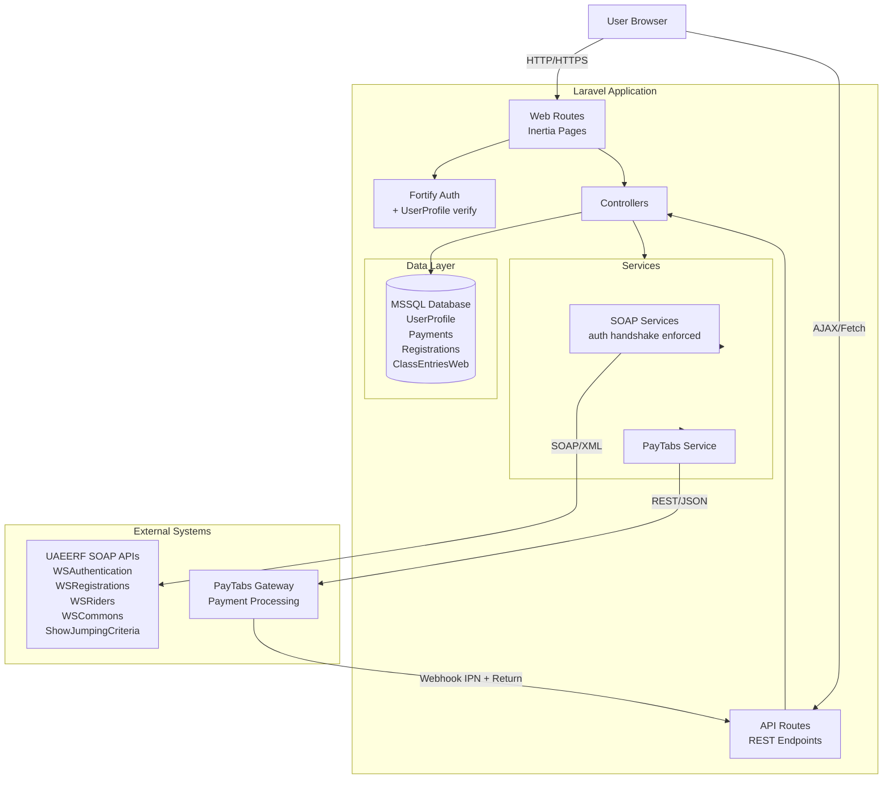
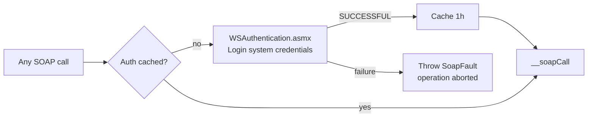
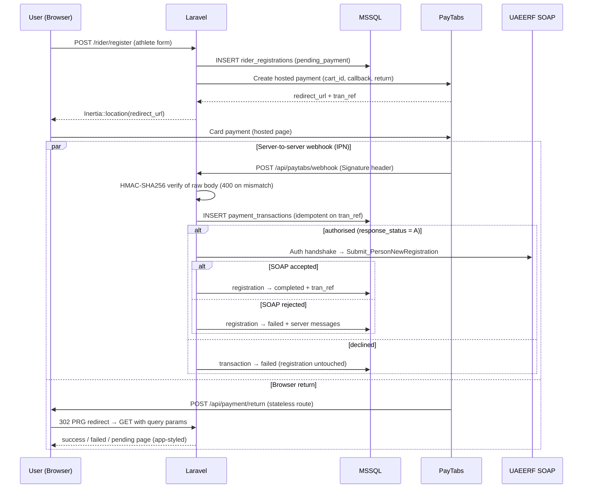
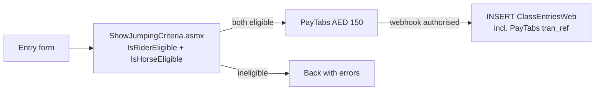

# UAEERF Portal - System Architecture

## Overview

Full-stack equestrian portal integrating MSSQL database, SOAP web services, and PayTabs payment gateway.

**Stack:** Laravel 13 + React 19 + Inertia.js + MSSQL + SOAP + PayTabs

---

## System Architecture



---

## SOAP Authentication Handshake (Evaluation Criterion)

Every SOAP operation passes through `BaseSoapClient::call()`, which enforces a
login against `WSAuthentication.asmx` **before** any other service is invoked
(result cached 1 hour):



| Service class | Endpoint | Purpose |
|---|---|---|
| `AuthenticationService` | WSAuthentication.asmx | System login handshake |
| `CommonsService` | WSCommons.asmx | Cities, countries, genders, disciplines, categories, seasons, visa categories — **cached 24 h** |
| `RegistrationsService` | WSRegistrations.asmx | `Submit_PersonNewRegistration` / `Submit_PersonRenewal` (full WSDL `PersonRegEntries` struct) |
| `RidersService` | WSRiders.asmx | `SearchRiderList` — renewal rider lookup |
| `ShowJumpingCriteriaService` | ShowJumpingCriteria.asmx | `IsRiderEligible` / `IsHorseEligible` |

---

## Payment Flow (webhook is source of truth)



**Critical rules:**

- ✅ Webhook is the source of truth (return URL is display-only)
- ✅ Database completion / SOAP submission ONLY after confirmed payment
- ✅ Signature = HMAC-SHA256 of the **raw request body** with the server key
- ✅ Idempotency: duplicate webhooks short-circuit on existing `tran_ref`
- ✅ `cart_id` prefix routes processing: `rider_reg_` / `rider_renewal_` / `jumping_`
- ✅ Return route is **stateless** (API group) so PayTabs' cross-site POST cannot
  rotate the authenticated session cookie
- ✅ Transaction reference stored with every entry

---

## Show Jumping Entry (AED 150)



---

## Identity & Access (Task 1)

- **Registration** — Fortify `CreateNewUser` dual-writes: local `users` row
  (Laravel auth) **and** MSSQL `UserProfile` row.
- **Login** — custom `Fortify::authenticateUsing`: local credential check
  **plus** verification against `UserProfile.Password`. A profile password
  mismatch denies login; MSSQL being unreachable logs an error and degrades
  gracefully (no lockout on infrastructure failure).

---

## Rider Renewal Lookup (Task 3 "Query rider")

`GET /api/riders/search?q=` (authenticated, validated) → `RidersService::searchRiders()`
→ `SearchRiderList` on WSRiders.asmx → mapped to
`{rider_id, name, dob, nationality, registered_current_season}`.
The renewal page uses a debounced type-ahead; real federation rider IDs
(`E00xxxxx`, nvarchar) flow through to `Submit_PersonRenewal.PersonID`.

---

## Security Features

- Webhook signature verification (HMAC-SHA256, raw body)
- Idempotency checks (duplicate webhook prevention)
- Rate limiting (10 req/min on payment initiation endpoints)
- Payment-before-database-write flow
- SOAP system credentials via environment only (never hardcoded)
- Session-safe stateless payment return route
- Mass-assignment protection, LIKE-wildcard escaping, no `dangerouslySetInnerHTML`

---

## API Endpoints

### Public
```
GET  /api/commons/*             # Cached SOAP lists (cities, countries, genders, ...)
```

### Protected (auth)
```
POST /rider/register            # Registration → PayTabs (AED 100)
POST /rider/renew               # Renewal → PayTabs (AED 50)
POST /jumping/validate          # Eligibility check (AJAX)
POST /jumping/entry             # Entry → PayTabs (AED 150)
GET  /api/riders/search?q=      # Rider lookup for renewals
```

### Payment (no auth — verified by signature / display-only)
```
POST     /api/paytabs/webhook   # PayTabs IPN (HMAC verified)
GET|POST /api/payment/return    # User return URL (stateless, PRG)
```

---

## Testing

68 automated tests (Pest) covering registration validation, payment webhook
security (signature, idempotency, declined/authorised paths, SOAP
success/rejection for registrations **and** renewals), payment return pages,
rider search endpoint, and UserProfile-verified login. MSSQL is faked as an
in-memory SQLite connection per test — the suite runs with no external
dependencies.

---

## Known Environment Limitation

`Submit_PersonNewRegistration` on the WS_TEST environment returns
**"Invalid User ID" for every UserId value** — verified with a fresh,
server-side-confirmed session (`WSUserAuth` row present for our IP) against the
assessment portal account `testings@uaeerf.ae` (UserID 6422), existing users,
`0`, and all `PersonType` values. Every other field validation passes (name,
DOB ≥ 11y, nationality/gender/city/country IDs, email, mobile, address, PO box,
weight, EID format). The blocker is server-side permissioning for the WS_TEST
account; the service's rejection messages are captured verbatim in
`rider_registrations.error_message`. Raised with the UAEERF technical contact.

Deferred by scope: profile-photo upload (`Submit_Document`).

---

**Built for:** UAEERF Technical Assessment
