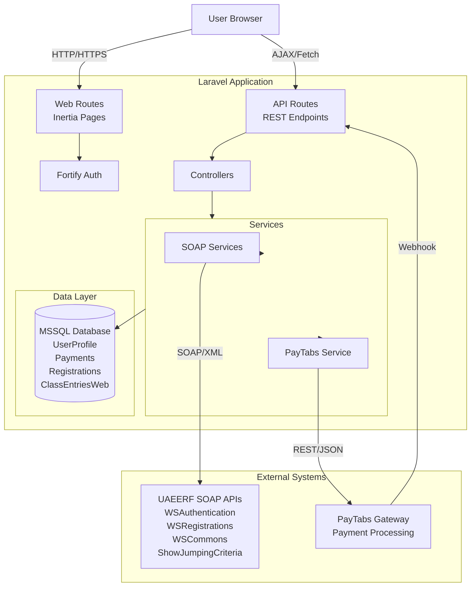

# UAEERF Portal - System Architecture

## Overview

Full-stack equestrian portal integrating MSSQL database, SOAP web services, and PayTabs payment gateway.

**Stack:** Laravel 13 + React 19 + Inertia.js + MSSQL + SOAP + PayTabs

---

## System Architecture



---

## Key Components

### Frontend
- **React 19** + TypeScript + Inertia.js
- **Tailwind CSS 4** + shadcn/ui components
- **Pages:** Welcome, Dashboard, Registration, Renewal, Show Jumping Entry

### Backend
- **Controllers:** PayTabs, Rider, ShowJumping
- **Repositories:** Payment, Registration, Renewal, Entry (with transaction support)
- **Services:** SOAP clients, PayTabs integration

### Database
- **MSSQL Server** ([REDACTED])
- **Tables:** UserProfile, ClassEntriesWeb, payment_transactions, rider_registrations, rider_renewals, show_jumping_entries
- **Note:** SQLite used only for unit testing

---

## Payment Flow

```
1. User submits registration form
2. Controller creates pending record (MSSQL)
3. PayTabs payment page created
4. User redirected to PayTabs → completes payment
5. PayTabs webhook → /api/paytabs/webhook (signature verified)
6. Check duplicate (idempotency)
7. Payment confirmed → DB transaction:
   - Call SOAP service (if applicable)
   - Update status to 'completed'
   - Insert into ClassEntriesWeb (if jumping entry)
   - Mark payment as processed
8. User redirected to return URL
```

**Critical Rules:**
- ✅ Webhook is source of truth (not return URL)
- ✅ Database write ONLY after payment confirmed
- ✅ Transaction reference stored with all entries
- ✅ Signature verification on all webhooks
- ✅ Idempotency check prevents duplicate processing

---

## SOAP Integration

### Endpoints

| Service | URL | Purpose |
|---------|-----|---------|
| WSAuthentication | http://[REDACTED]/webservices/WSAuthentication.asmx | System auth |
| WSCommons | http://[REDACTED]/webservices/WSCommons.asmx | Common lists (cached 24h) |
| WSRegistrations | http://[REDACTED]/webservices/WSRegistrations.asmx | Rider registration/renewal |
| ShowJumpingCriteria | http://[REDACTED]/webservices/ShowJumpingCriteria.asmx | Eligibility validation |

### Authentication
- System credentials: `[REDACTED]` / `[REDACTED]`
- Authenticated before calling other services
- Response cached for performance

---

## Database Schema (MSSQL)

```sql
-- UserProfile (user master data)
CREATE TABLE UserProfile (
    UserID INT PRIMARY KEY IDENTITY,
    Email NVARCHAR(255) UNIQUE,
    Password NVARCHAR(255),
    FullName NVARCHAR(255),
    MobileNumber NVARCHAR(20),
    City NVARCHAR(100),
    RegistrationDate DATETIME
);

-- ClassEntriesWeb (show jumping - payment confirmed only)
CREATE TABLE ClassEntriesWeb (
    EntryID INT PRIMARY KEY IDENTITY,
    RiderID INT,
    HorseID INT,
    EventID INT,
    ClassID INT,
    TransactionReference NVARCHAR(255),
    EntryDate DATETIME,
    Status NVARCHAR(50),
    PaymentAmount DECIMAL(10,2)
);

-- payment_transactions
CREATE TABLE payment_transactions (
    id INT PRIMARY KEY IDENTITY,
    tran_ref NVARCHAR(255) UNIQUE,
    cart_id NVARCHAR(255) UNIQUE,
    amount DECIMAL(10,2),
    status NVARCHAR(50),
    processed BIT DEFAULT 0,
    created_at DATETIME
);

-- rider_registrations
CREATE TABLE rider_registrations (
    id INT PRIMARY KEY IDENTITY,
    user_id INT,
    cart_id NVARCHAR(255) UNIQUE,
    rider_name NVARCHAR(255),
    date_of_birth DATE,
    status NVARCHAR(50),
    tran_ref NVARCHAR(255),
    created_at DATETIME
);

-- rider_renewals, show_jumping_entries (similar structure)
```

---

## Security Features

✅ **Payment Security:**
- Webhook signature verification (HMAC-SHA256)
- Idempotency checks (duplicate prevention)
- Rate limiting (10 requests/min)
- Payment-before-database-write flow

✅ **Authentication:**
- Laravel Fortify
- SOAP system credentials (not user credentials)
- Session management

✅ **Data Integrity:**
- Database transactions for atomic operations
- Repository pattern (no direct DB calls in controllers)
- Foreign key constraints removed (dual-database architecture)

---

## API Endpoints

### Public
```
GET  /api/commons/cities      # City list (cached)
GET  /api/commons/divisions   # Division levels
GET  /api/commons/disciplines # Disciplines
```

### Protected (auth required)
```
POST /rider/register          # Rider registration → PayTabs (AED 100)
POST /rider/renew             # Rider renewal → PayTabs (AED 50)
POST /jumping/entry           # Competition entry → PayTabs (AED 150)
POST /jumping/validate        # Eligibility check
```

### Webhooks
```
POST /api/paytabs/webhook     # PayTabs IPN (signature verified)
GET  /payment/return          # User return URL (display only)
```

---

## Directory Structure

```
app/
├── Http/Controllers/
│   ├── PayTabsController.php      # Webhook + return URL
│   ├── RiderController.php        # Registration + renewal
│   └── ShowJumpingController.php  # Entry validation
├── Repositories/
│   ├── PaymentTransactionRepository.php
│   ├── RiderRegistrationRepository.php
│   └── ShowJumpingEntryRepository.php
└── Services/
    ├── PayTabsService.php
    └── Soap/
        ├── AuthenticationService.php
        ├── CommonsService.php
        ├── RegistrationsService.php
        └── ShowJumpingCriteriaService.php

resources/js/
├── pages/
│   ├── welcome.tsx            # Landing page
│   ├── dashboard.tsx          # User dashboard
│   ├── rider/
│   │   ├── registration.tsx
│   │   └── renewal.tsx
│   └── jumping/
│       └── entry.tsx
└── components/
    └── ui/                    # shadcn/ui components

docs/
├── ARCHITECTURE.md            # This file
└── architecture-diagram.png   # Visual diagram
```

---

## Configuration

**Required Environment Variables:**
```bash
# MSSQL Database
DB_HOST=[REDACTED]\DEVSQL,50441
DB_USER=[REDACTED]
DB_PASSWORD=[REDACTED]
DB_NAME=EEFRegistration

# SOAP Authentication
SOAP_AUTH_USERNAME=[REDACTED]
SOAP_AUTH_PASSWORD=[REDACTED]

# PayTabs
PAYTABS_PROFILE_ID=<your_profile_id>
PAYTABS_SERVER_KEY=<your_server_key>
PAYTABS_CALLBACK_URL=https://your-domain.com/api/paytabs/webhook
```

---

## Assessment Compliance

✅ **Task 1:** User registration → UserProfile (MSSQL)  
✅ **Task 2:** SOAP common lists with 24h caching  
✅ **Task 3:** Rider registration/renewal with PayTabs  
✅ **Task 4:** Show jumping entry with eligibility validation  
✅ **Security:** Webhook signature verification, payment-first flow  
✅ **Architecture:** Proper separation of concerns, repository pattern

---

**Built for:** UAEERF Technical Assessment  
**Completion Date:** 2026-07-25
