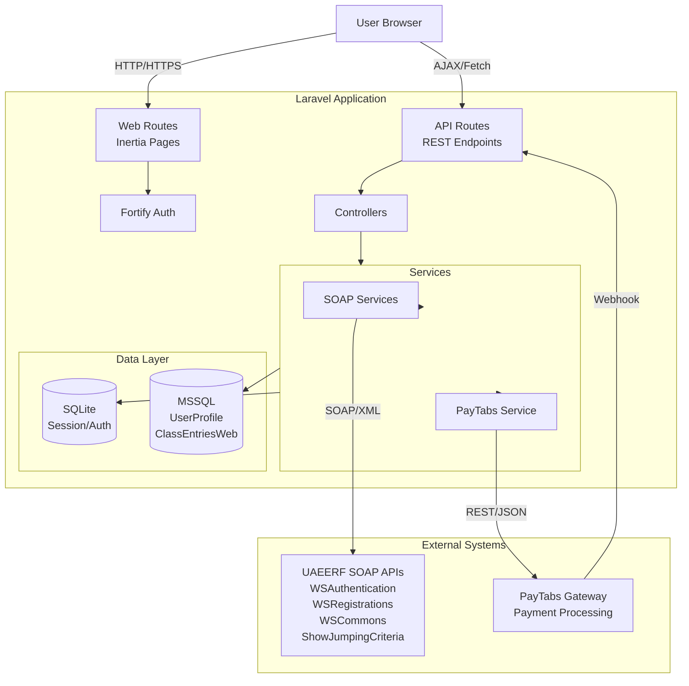
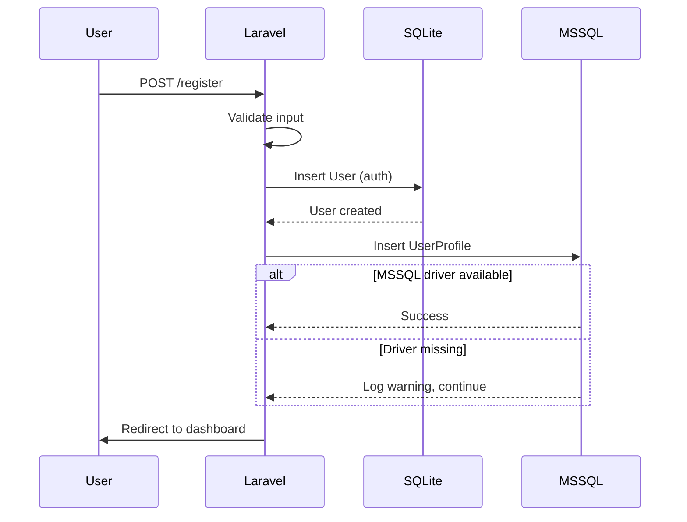
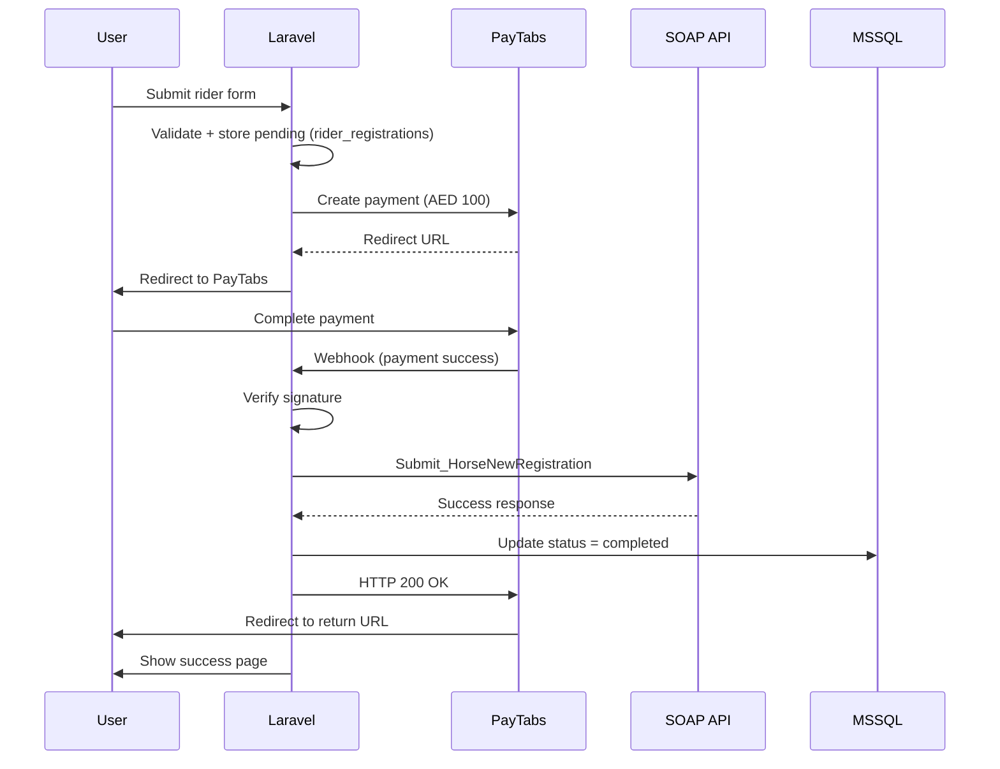
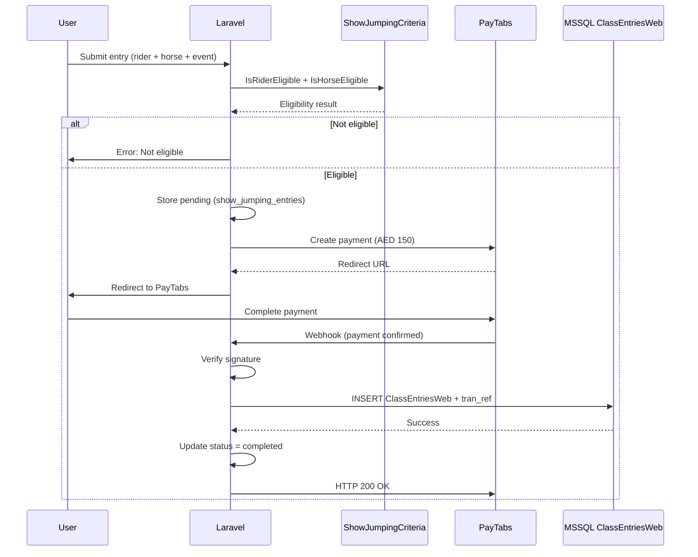
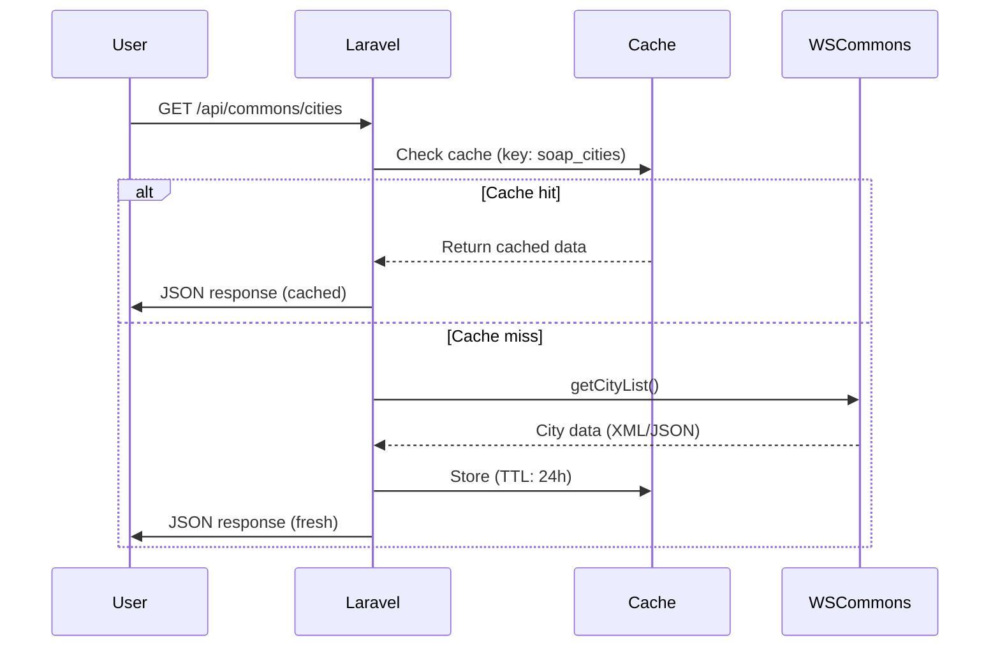

# UAEERF Portal - System Architecture

## Overview

Full-stack equestrian portal integrating MSSQL database, SOAP web services, and PayTabs payment gateway.

**Stack:** Laravel 13 + React 19 + Inertia.js + MSSQL + SOAP + PayTabs

---

## High-Level Architecture



---

## Component Breakdown

### Frontend Layer

**Technology:** React 19 + TypeScript + Inertia.js + Tailwind CSS 4

```
resources/js/
├── Pages/           # Inertia page components
│   ├── welcome.tsx
│   └── dashboard.tsx
└── Components/      # Reusable UI components
    └── ui/          # shadcn/radix components
```

**Responsibilities:**
- User interface rendering
- Form validation (client-side)
- API calls via Inertia/Axios
- Real-time feedback

---

### Backend Layer

#### Controllers

```
app/Http/Controllers/
├── Api/
│   └── CommonsController.php      # City/Division lists
├── PayTabsController.php          # Payment webhook + return
├── RiderController.php            # Rider reg/renewal
└── ShowJumpingController.php      # Entry validation + payment
```

**Responsibilities:**
- Request validation
- Business logic orchestration
- Response formatting

#### Service Layer

```
app/Services/
├── PayTabsService.php             # Payment gateway integration
└── Soap/
    ├── BaseSoapClient.php         # SOAP base class
    ├── AuthenticationService.php  # SOAP auth
    ├── CommonsService.php         # Common lists
    ├── RegistrationsService.php   # Rider/horse registration
    └── ShowJumpingCriteriaService.php # Eligibility validation
```

**Responsibilities:**
- External API integration
- Data transformation
- Error handling
- Caching strategy

---

## Data Flow Diagrams

### Flow 1: User Registration



**Key Points:**
- Dual database write (SQLite + MSSQL)
- Graceful MSSQL fallback
- Laravel auth uses SQLite

---

### Flow 2: Rider Registration with Payment



**Critical Rule:** Payment MUST succeed before SOAP call.

**Payment Amounts:**
- New Registration: AED 100
- Renewal: AED 50
- Show Jumping Entry: AED 150

---

### Flow 3: Show Jumping Entry



**Critical:** `ClassEntriesWeb` insert happens ONLY after payment webhook confirms success.

---

### Flow 4: Common Lists (Cached)



**Cache Strategy:**
- TTL: 24 hours
- Keys: `soap_cities`, `soap_divisions`, `soap_disciplines`, etc.
- Manual invalidation: `POST /api/admin/commons/clear-cache`

---

## Database Schema

### SQLite (Local - Laravel Auth)

```sql
-- users (Fortify/Laravel)
CREATE TABLE users (
    id INTEGER PRIMARY KEY,
    name VARCHAR(255),
    email VARCHAR(255) UNIQUE,
    password VARCHAR(255),
    two_factor_secret TEXT,
    created_at TIMESTAMP,
    updated_at TIMESTAMP
);

-- payment_transactions (local tracking)
CREATE TABLE payment_transactions (
    id INTEGER PRIMARY KEY,
    tran_ref VARCHAR(255) UNIQUE,
    cart_id VARCHAR(255) UNIQUE,
    amount DECIMAL(10,2),
    currency VARCHAR(3),
    status ENUM('pending','success','failed'),
    webhook_payload JSON,
    processed BOOLEAN DEFAULT FALSE,
    created_at TIMESTAMP
);

-- rider_registrations (pending + completed)
CREATE TABLE rider_registrations (
    id INTEGER PRIMARY KEY,
    user_id INTEGER REFERENCES users(id),
    cart_id VARCHAR(255) UNIQUE,
    rider_name VARCHAR(255),
    date_of_birth DATE,
    status ENUM('pending_payment','completed','failed'),
    tran_ref VARCHAR(255),
    soap_response TEXT,
    created_at TIMESTAMP
);

-- rider_renewals
CREATE TABLE rider_renewals (
    id INTEGER PRIMARY KEY,
    user_id INTEGER REFERENCES users(id),
    cart_id VARCHAR(255) UNIQUE,
    rider_id INTEGER,
    season_id INTEGER,
    status ENUM('pending_payment','completed','failed'),
    tran_ref VARCHAR(255),
    created_at TIMESTAMP
);

-- show_jumping_entries
CREATE TABLE show_jumping_entries (
    id INTEGER PRIMARY KEY,
    user_id INTEGER REFERENCES users(id),
    cart_id VARCHAR(255) UNIQUE,
    rider_id INTEGER,
    horse_id INTEGER,
    event_id INTEGER,
    class_id INTEGER,
    status ENUM('pending_payment','completed','failed'),
    tran_ref VARCHAR(255),
    created_at TIMESTAMP
);
```

### MSSQL (UAEERF Production Database)

```sql
-- UserProfile (user master data)
-- [WEBSQL].[EEFRegistration].[dbo].[UserProfile]
CREATE TABLE UserProfile (
    UserID INT PRIMARY KEY IDENTITY,
    Email NVARCHAR(255) UNIQUE,
    Password NVARCHAR(255),
    FullName NVARCHAR(255),
    MobileNumber NVARCHAR(20),
    City NVARCHAR(100),
    Country NVARCHAR(3),
    RegistrationDate DATETIME,
    Status NVARCHAR(50)
);

-- ClassEntriesWeb (show jumping entries)
-- CRITICAL: Only written after payment confirmed
CREATE TABLE ClassEntriesWeb (
    EntryID INT PRIMARY KEY IDENTITY,
    RiderID INT,
    HorseID INT,
    EventID INT,
    ClassID INT,
    TransactionReference NVARCHAR(255), -- PayTabs tran_ref
    EntryDate DATETIME,
    Status NVARCHAR(50),
    PaymentAmount DECIMAL(10,2),
    PaymentCurrency NVARCHAR(3),
    CreatedAt DATETIME
);
```

---

## SOAP Integration

### Endpoints

| Service | WSDL | Purpose |
|---------|------|---------|
| WSAuthentication | http://wsdev.emiratesequestrian.ae/webservices/WSAuthentication.asmx?WSDL | System login |
| WSCommons | http://wsdev.emiratesequestrian.ae/webservices/WSCommons.asmx?WSDL | Common lists |
| WSRegistrations | http://wsdev.emiratesequestrian.ae/webservices/WSRegistrations.asmx?WSDL | Rider/horse reg |
| ShowJumpingCriteria | http://wsdev.emiratesequestrian.ae/webservices/ShowJumpingCriteria.asmx?WSDL | Eligibility |

### Authentication

```php
// System credentials (not user credentials)
Username: WS_TEST
Password: TEST@0123

// Usage
$authService->login('WS_TEST', 'TEST@0123');
// Response: { Message: "SUCCESSFUL" }
```

### Key Operations

**WSCommons:**
- `getCityList()` → Cities (Abu Dhabi, Dubai, etc.)
- `getJumpingDivisionLevelList()` → Divisions
- `getDisciplineList()` → Disciplines
- `getSeasonList()` → Seasons

**WSRegistrations:**
- `Submit_HorseNewRegistration()` → New rider
- `Submit_HorseRenewal()` → Renew rider
- `Get_HorseOwner()` → Owner details

**ShowJumpingCriteria:**
- `IsRiderEligible()` → Validate rider
- `IsHorseEligible()` → Validate horse

---

## PayTabs Integration

### Payment Flow

```
1. User submits form
2. Laravel creates payment request
3. PayTabs returns redirect_url
4. User redirected to PayTabs hosted page
5. User completes payment
6. PayTabs sends webhook to /api/paytabs/webhook
7. Laravel verifies signature, processes
8. PayTabs redirects user to return_url
```

### Webhook Security

```php
// Signature verification
$signature = hash_hmac('sha256', json_encode($payload), $serverKey);
if (!hash_equals($signature, $requestSignature)) {
    return 401; // Reject
}
```

### Payment Types

| Type | Amount | cart_id Format | On Success |
|------|--------|----------------|------------|
| Rider Registration | AED 100 | `rider_reg_{userId}_{unique}` | Call WSRegistrations |
| Rider Renewal | AED 50 | `rider_renewal_{userId}_{unique}` | Call WSRegistrations |
| Show Jumping Entry | AED 150 | `jumping_{userId}_{unique}` | Insert ClassEntriesWeb |

---

## Security Considerations

### Payment Security

✅ **Webhook is source of truth** (not return URL)  
✅ **Signature verification** on all webhooks  
✅ **Idempotency** - same cart_id processed once  
✅ **Payment before DB write** - never write on payment initiation  

### SOAP Security

✅ **System credentials** stored in `.env`  
✅ **Input sanitization** before SOAP calls  
✅ **XML injection prevention**  

### General

✅ **No credentials in git** (`.env` in `.gitignore`)  
✅ **HTTPS only** for webhooks  
✅ **Rate limiting** on payment endpoints  
✅ **CSRF protection** on web routes  
✅ **SQL injection protection** (Eloquent/Query Builder)  

---

## Deployment Topology

```
┌─────────────────────────────────────────────┐
│            Production Environment            │
├─────────────────────────────────────────────┤
│                                             │
│  ┌─────────────┐      ┌─────────────┐     │
│  │   Nginx     │─────▶│   PHP-FPM   │     │
│  │  (Reverse   │      │  (Laravel)  │     │
│  │   Proxy)    │      └──────┬──────┘     │
│  └─────────────┘             │             │
│                              │             │
│         ┌────────────────────┼────────┐   │
│         │                    │        │   │
│    ┌────▼────┐        ┌──────▼──┐  ┌─▼──┐│
│    │ SQLite  │        │  MSSQL  │  │Redis││
│    │(Session)│        │  Server │  │Cache││
│    └─────────┘        └─────────┘  └─────┘│
│                                             │
└─────────────────────────────────────────────┘
          │                    │
          │                    │
   ┌──────▼──────┐      ┌──────▼──────┐
   │SOAP Services│      │   PayTabs   │
   │   (UAEERF)  │      │   Gateway   │
   └─────────────┘      └─────────────┘
```

---

## Performance Optimizations

1. **SOAP Response Caching** - Common lists cached 24h
2. **Database Connection Pooling** - MSSQL persistent connections
3. **Queue Processing** - Async SOAP calls (future)
4. **CDN for Assets** - Static files served from edge
5. **Opcode Cache** - OPcache enabled for PHP

---

## Monitoring & Logging

**Log Channels:**
```
storage/logs/laravel.log
├── SOAP requests/responses
├── PayTabs webhooks
├── Payment status changes
├── MSSQL connection errors
└── Authentication failures
```

**Key Metrics:**
- Payment success rate
- SOAP API response time
- MSSQL connection failures
- Webhook processing time

---

## Error Handling Strategy

```php
// Graceful degradation
try {
    $result = $soapService->call();
} catch (SoapFault $e) {
    Log::error('SOAP call failed', ['error' => $e->getMessage()]);
    return response()->json(['error' => 'Service temporarily unavailable'], 503);
}

// MSSQL fallback
try {
    UserProfile::create($data);
} catch (Exception $e) {
    Log::warning('MSSQL sync failed', ['error' => $e->getMessage()]);
    // Continue - user still created in SQLite
}
```

---

## Future Enhancements

- [ ] Queue system for async SOAP calls
- [ ] Admin dashboard for payment reconciliation
- [ ] Email notifications on payment success
- [ ] Rider/Horse management UI
- [ ] Event calendar integration
- [ ] PDF receipt generation
- [ ] Multi-language support (Arabic/English)
- [ ] Mobile app (React Native)

---

**Document Version:** 1.0  
**Last Updated:** 2026-07-23  
**Author:** Development Team
